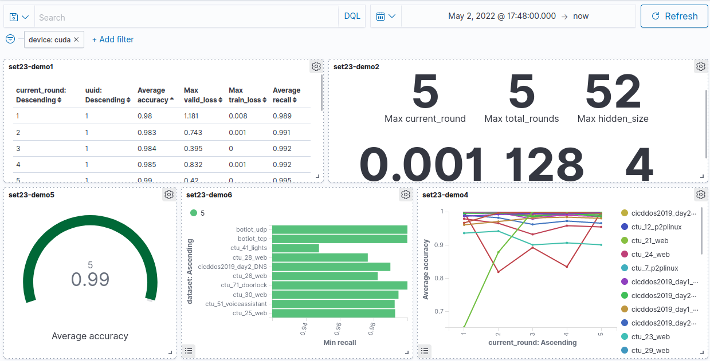

# Detecting Cyber Threats from a Network Edge
## Main code from the research project
### Detecting DDoS attacks from lightweight IoT devices using Federated Learning, considering the complications of a practical environment.




## Features Targeted
- Single-party federated learning with multiple aggregation methods.
- Attack/Benign traffic type splitting, Pareto traffic distribution.
- Performance and computation time analysis, comparison with centralised alternative.
- Each node validated against each traffic type, not just an aggregate of all.
- Server/Client Docker images based on Ubuntu 20.04 LTS.
- CPU/CUDA support.
- Keep it simple - targeting lightweight hardware.
- Multi-threading and memory management, parallelise multiple nodes for simulations.
- Reproducible/deterministic results.
- Pytorch based - compact LSTM model.
- Ease of use: single script and config file to build, prepare data and run simulation.
- Verbose statistics pulled from all nodes, with support for real-time display and storage using OpenSearch.
- Scriptable configuration and simulation options.
- Modular and adaptable.
- Server/client nodes controlled through RESTful requests, simulation script provided for automation during research.
- Uses layer 3/4 (transport and network) packet header features, does not require interacting with any application data.
- Asynchronous where possible.

## Dependencies

Includes those within the custom docker images.

For host python dependencies setup and activate a virtual environment: 

`python3 -m venv [envname]; source [envname]/bin/activate`

Linux based environment with a bash shell, however the code could be adapted to run on others.

- Docker 20.10.12
- Docker-compose 1.27.4 (syntax version 3.7 used)
- Python 3.9.7
- jq 1.6
- pytorch 1.11.0 (does not require torchvision etc.)
- pandas 1.3.5
- numpy 1.21.4
- aiohttp 3.8.1
- requests 2.27.1
- nfstream 6.4.2
- scikit-learn 1.0.2
- opensearchproject/opensearch:1.2.4
- opensearchproject/opensearch-dashboards:1.2.0
- ubuntu:20.04
- tcmalloc minimal
- GNU OpenMP

Additional for CUDA support:

- nvidia-container-toolkit 1.9.0 (for CUDA support)
- nvidia cuda compiler driver 11.3
- pytorch 1.11.0+cu113
- nvidia/cuda 11.3.1-runtime-ubuntu20.04

## Configuration

### config.json

Default, implementation wide:

- default/pcapPath     - Where processed PCAP files are stored, absolute path. (str)
- default/featurePath  - Where processed features (dataframes) are stored, absolute path. (str)
- default/dataPath     - Where data ready for nodes is stored, absolute path. (str)
- default/seed         - Seed to be used in pseudo-random generators throughout. (int)

Data processing:

- data/datasets        - List of datasets to use simulations, must be in features path, name and type, 1-attack, 0-benign. (2d array of str, int)
- data/inputSize       - Number of features that will be used in simulations. (int)
- data/splitTrain      - How many bidirectional streams (rows) will be used for training. (float)
- data/splitTest       - "_" but for testing, training+testing should equal 1. (float)
- data/features        - List of features to be used in training and testing, dataframe column names. (array of str).

Machine learning model (LSTM):

- model/learnRate      - Adam optimiser initial learn rate, on each node. (float)
- model/batchSize      - How many streams/rows should be passed to the LSTM simultaneously and before weight update, see pytorch docs. (int)

Federated learning:

- federated/fedWeight  - Multiplier given to each traffic type when using FedWeighted aggregation method (dict of str, int)

Pareto distribution traffic split:

- longtail/maxNodes
- longtail/lowerBound
- longtail/coefficient

### run_simulation.sh

Command line arguments in order:

1.  NUMNODES          - Number of nodes to deploy.
2.  NUMEPOCHS         - Number of epochs each training round.
3.  SEQUENCELENGTH    - Sequence length of LSTM, how many bidirectional streams per window.
4.  HIDDENSIZE        - LSTM hidden/cell state size.
5.  NUMROUNDS         - Number of training/validation rounds.
6.  SETLABEL          - Statistics index to use for this simulation.
7.  DEVICETYPE        - cpu/cuda
8.  OFFLOAD           - Offload model from VRAM in between training/validation rounds.
9.  THREADLIMIT       - Number of nodes/clients that can train/validate simultaneously.
10. ATTACKSPLIT       - Whether to split attack traffic types between nodes.
11. BENIGNSPLIT       - "_" but benign traffic types.
12. FEDMETHOD         - Aggregation method: FedAVG, FedDiverse, FedWeighted.
13. VALIDATIONSTATES  - How often each node should validate against all traffic types:
	- 0 - never
	- 1 - each round but only after aggregation
	- 2 - each round before and after aggregation
	- 3 - only after the final training round, after aggregation
14. LONGTAIL          - Whether to distribute traffic to each node using with the Pareto distribution.


## Running a simulation

- Split/merge PCAP files into attack types and time periods (e.g. XYZ_UDPFlood_Day1), use frame time to get UNIX time in ms. `development/pcap_commands.sh`

- Extract features for each attack type dataset into a Pandas dataframe, save each to disk. `python3 extract_features.py`

- Decide on which features you want to use, calculating chi2 and fclass test measures (see sklearn docs) may aid with this.

- Update config file with info above, as well as: seed, train/test split, learn rate, batch size, initial multipliers, pareto distribution parameters. `config.json`

- Start the OpenSearch database, dashboard and network using the docker-compose file. `docker-compose -p fyp -f docker/stats/docker-compose.yml up -d`

- Generate the indices to store results of simulation `python3 statistics.py`

- Either run the simulation manually from cmd or produce a batch script to cycle through multiple, examples given in 'sets/'. `bash run_simulation.sh [arguments]`

- Create visualisations to review stats within OpenSearch dashboard.

- To kill a simulation early, `bash kill_simulation.sh [numNodes]`


## Please note:
- In this state the code is not suitable for secure deployment in a production environment.
- Nodes are assumed to be acting in good faith, some sources of insecurity are highlighted within code.
- It does not enforce authentication or strict input validation.
- The OpenSearch dashboard and database run with security disabled, only expose endpoints to localhost.


## Example datasets

Note: No data or results are included within this repository. For reference.

- [CICDDoS2019](https://www.unb.ca/cic/datasets/ddos-2019.html)
- [Bot-IoT](https://research.unsw.edu.au/projects/bot-iot-dataset)
- [Ton-IoT](https://research.unsw.edu.au/projects/toniot-datasets)
- [CTU-{7,12,20-32,41,51,71}](https://www.stratosphereips.org/datasets-overview)


## Future considerations

- Automatic adjustment of multipliers of FedWeighted (aggregation method) on a round by round basis.
- Implement support for TPU-like devices
- Move to an existing Federated Learning framework for more complex aggregation methods and homomorphic encryption support.
- Correct return codes after error (i.e. not 500).
- Input validation.
- Token based authentication system.
- Move model parameter communication away from pickle (object-based comms insecure and allow for hashing).
- Compile out unused pytorch libraries to reduce disk and memory use + reducing size of CUDA context of each node during simulation.
- Switch to a more minimal distro, to reduce memory footprint and harden.
- Considerations for incentive and consensus.
- Increase verbosity of cmd output, especially for server nodes.

## 

```
Copyright (C) 2022 Matthew Jowett

THE SOFTWARE IS PROVIDED "AS IS", WITHOUT WARRANTY OF ANY KIND, EXPRESS OR
IMPLIED, INCLUDING BUT NOT LIMITED TO THE WARRANTIES OF MERCHANTABILITY,
FITNESS FOR A PARTICULAR PURPOSE AND NONINFRINGEMENT. IN NO EVENT SHALL THE
AUTHORS OR COPYRIGHT HOLDERS BE LIABLE FOR ANY CLAIM, DAMAGES OR OTHER
LIABILITY, WHETHER IN AN ACTION OF CONTRACT, TORT OR OTHERWISE, ARISING FROM,
OUT OF OR IN CONNECTION WITH THE SOFTWARE OR THE USE OR OTHER DEALINGS IN THE
SOFTWARE.
```
